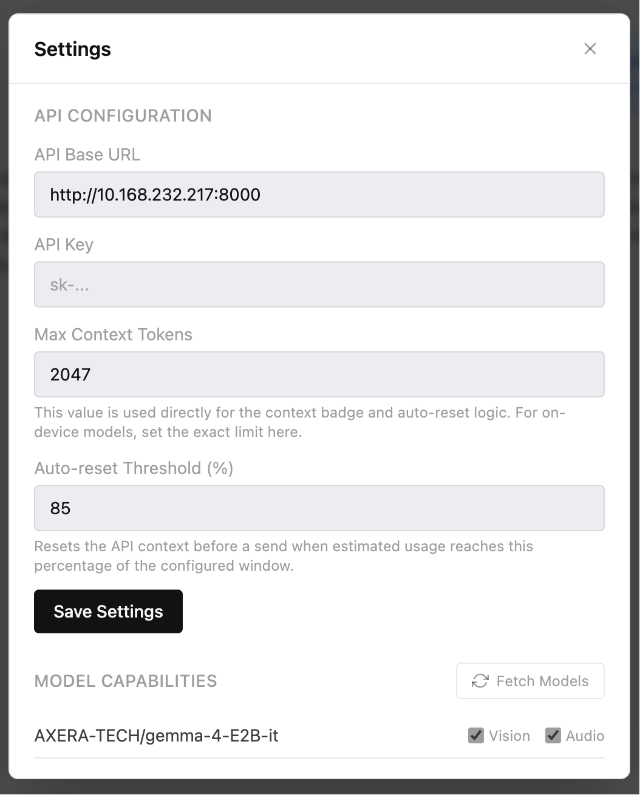

# AXERA Lite WebUI

A lightweight, local-first chat UI for OpenAI-compatible APIs.

It runs entirely in the browser, supports streaming responses, and stores conversations locally.

## Demo

The clip below shows SD 1.5 text-to-image and image-to-image generation, then PaddleOCR performing OCR on an uploaded image — all from the same interface without any page reload or configuration change.

<video src="assets/lite_webui_sd1.5_ocr_demo.mov" controls width="100%"></video>

## Features

- OpenAI-compatible chat interface
- Streaming responses
- Markdown rendering with code highlighting and KaTeX math
- Collapsible thinking / reasoning blocks (`<think>` tags)
- Image generation (Draw mode) and image-to-image via compatible image APIs
- Image upload and paste for vision-capable models
- Audio transcription workflow for compatible APIs
- Multiple API endpoints with per-endpoint model management
- Model capability configuration (Vision, Audio, Draw) per endpoint
- Generated images stored as data URLs — persist after backend restart
- Local conversation history in the browser
- Configurable context window and auto-reset threshold
- Light and dark themes

## Requirements

- Node.js 18+
- An OpenAI-compatible API that supports:
  - `GET /v1/models`
  - `POST /v1/chat/completions`
- Optional image generation:
  - `POST /v1/images/generations` or `POST /v1/images/edits`
- Optional audio support:
  - `POST /v1/audio/transcriptions`

## Quick Start

```bash
npm install
npm run dev
```

Open:

```text
http://localhost:5173
```

## First-Time Setup

1. Open **Settings**.
2. Enter your **API Base URL**.
3. Enter your **API Key** if your provider requires one.
4. Set **Max Context Tokens** to the real limit of your model.
5. Adjust **Auto-reset Threshold (%)** if needed.
6. Click **Fetch Models** — this saves the endpoint and fetches available models in one step.
7. Enable the capabilities (**Vision**, **Audio**, **Draw**) that apply to each model.
8. Select a model from the top bar.



### API Base URL

Use the server root URL. Do **not** append `/v1`.

Correct:

```text
http://127.0.0.1:8000
http://127.0.0.1:11434
https://your-api.example.com
```

Incorrect:

```text
http://127.0.0.1:8000/v1
http://127.0.0.1:11434/v1
```

### Multiple Endpoints

Add more than one endpoint in Settings to aggregate models from different servers. The model picker groups models by endpoint and switches the active endpoint automatically when you select a model.

## Usage

- **Send:** `Enter`
- **New line:** `Shift+Enter`
- **Reset API context only:** `/reset`
- **Clear current conversation and API context:** `/clean`

### Image Generation (Draw Mode)

- Enable **Draw** for the model in Settings.
- Click the **Draw** button in the input bar (auto-enabled for Draw-capable models).
- Optionally attach a reference image for image-to-image generation.
- Set a **seed** for reproducible results.
- Click **Regenerate** below any generated image to redraw with a new seed.

### Images

- Upload an image with the image button, or paste an image into the input box.
- The current model must have **Vision** enabled.

### Audio

- Attach an audio file from the input bar.
- The current model must have **Audio** enabled.
- Your API must support `POST /v1/audio/transcriptions`.

### Context Badge

The `ctx x/y` badge in the input bar shows:

- current estimated context usage
- configured context window limit

When usage approaches the configured threshold, the app automatically resets API context before the next send.

## Development and Deployment

### Development

```bash
npm run dev
```

Development mode includes a built-in proxy, which is useful when your API does not allow browser CORS requests during local development.

### Production Preview

```bash
npm run build
npm run preview
```

The production build is static. Your API must allow browser access directly, be served behind a reverse proxy, or share the same origin as the frontend.

## Commands

```bash
npm run dev
npm run build
npm run preview
npm test
```

## Data Storage

Settings, model capability overrides, theme preference, and conversations are stored in your browser with `localStorage`.

Generated images are converted to base64 data URLs on receipt and stored alongside the conversation, so they remain visible even after the backend is restarted or the page is reloaded.

Clearing site storage resets the app.

## Troubleshooting

### Fetch Models fails

- Make sure **API Base URL** does not include `/v1`.
- Confirm your API supports `GET /v1/models`.
- If it works in `npm run dev` but fails in preview or production, check CORS.

### Model list is empty

- Click **Fetch Models**.
- Verify the request succeeded.
- Confirm your API returns models from `GET /v1/models`.

### Image button is disabled

- Enable **Vision** for the selected model in **Settings**.

### Draw button is disabled

- Enable **Draw** for the selected model in **Settings**.
- Confirm your backend supports `POST /v1/images/generations`.

### Audio button is disabled

- Enable **Audio** for the selected model in **Settings**.
- Confirm your backend supports audio transcription.

### Requests fail even though the server is reachable

Make sure your backend is compatible with the OpenAI Chat Completions format, especially `model`, `messages`, and streaming responses.

